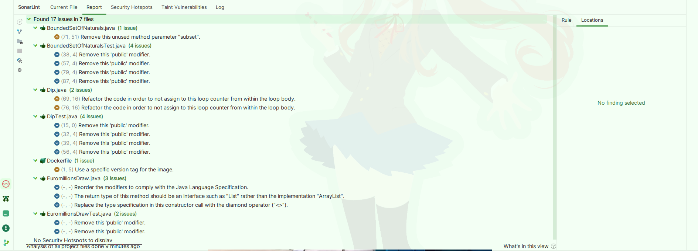

## Lab6_1 

#### Importante note :

I tried many ways, from the recomendation from the sonarqube website to alternatives in websites, i couldnt run sonarqube either as a docker conteiner or the community edition, i couldnt find any solution for the 
error/exception i had in both cases

Because of this issue, i tried to use sonarqube analysis with the integrated plugin, down a have the results of the report : 

### Sonarqube report : 

| issue        | problem description                                                                                                              | How to solve                                                                                                                                               |                             |
|--------------|----------------------------------------------------------------------------------------------------------------------------------|------------------------------------------------------------------------------------------------------------------------------------------------------------|-----------------------------|
| Code smell   | A for loop terminatiion should test the loop counter against an invariant avlue that does not change during the exec of the loop | Make the termination condition invariant by using a consta or a local variable instead of an expression that could change during the executing of the loop | Dip.java 69,16 76,16        |
| Code smell   | To readbility porpuses, Test classes and methods (for JUnit5) can have any visibilty except private                              | Change the visibilty from public to protect(package visibilty)                                                                                             | EuromillionsDrawTest.java   |
| Code Smell   | Declaration should avoid to use classes implementation                                                                           | Make the return type of the method be List instead of ArrayList                                                                                            | EuromillionsDraw.java 40,11 |
